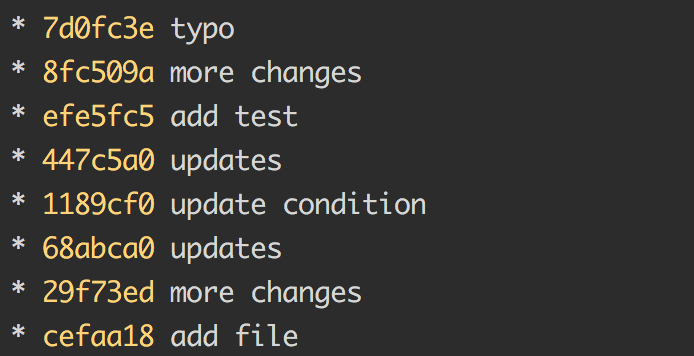
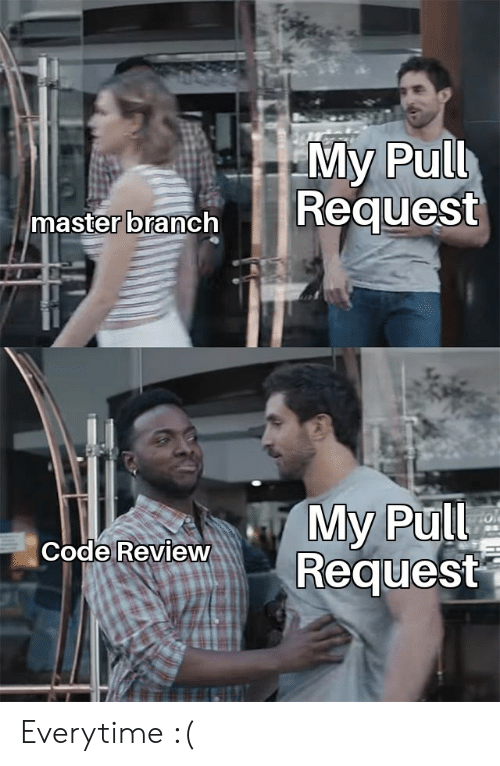

# Handbook for Best Coding Practices

## **Task Estimation**

### **Work Breakdown Structures**

**WBS** (Work Breakdown Structure) describes what tasks need to be completed in a project. However, it does not include factors such as timelines or resources. The goal of the WBS is to focus the team on what has to be done.

When you're breaking down what has to be done it is important to remove verbs from each level. You are not describing the tasks necessary to complete what has to be done, you are just describing them. Find out more [here](https://www.guru99.com/an-expert-view-on-test-estimation.html )

Some of the benefits of WBS include:
*   **Project Schedule:** Once you define all the tasks required to complete the project, as well as their hierarchical relationships, it will be much easier to assign resources and set deadlines.
*   **Accountability:** Since all elements in a WBS are mutually exclusive, it helps create accountability. A team assigned to a single work package is solely accountable for its completion. This reduces overlaps in responsibility.
*   **Commitment:** The WBS gives teams a very high-level overview of their responsibilities. Since each team is responsible for a specific component at a time, it helps make them more committed to completing their assigned tasks.
*   **Reduces ambiguities:** WBS involves the project manager, team members and relevant stakeholders. This encourages dialogue and so everyone knows exactly what they have to do. This way there is ambiguity.

If you want to read further click [here](https://www.workamajig.com/blog/guide-to-work-breakdown-structures-wbs?hs_amp=true)

### Three-point estimation

After splitting the tasks into sub-tasks, you now must ask the team or person responsible for each sub-task to provide a three-point estimation.

A three point-task estimation is the simple practice of estimating the worse, best and most realistic outcomes of tasks regarding time consumption.

* **B** = Best case estimate, the case where everything works perfectly
* **W** = worse case estimate, the case where everything seems to go wrong
* **M** = Most realistic estimate, the most realistic estimate based on experience.

Now after calculating these three values we will put them into the formula below:

**Task Duration** == *(B + W +(4 * M)) / 6*

__Let’s show an example:__

**(** *All Numbers should be rounded to the nearest integer* **)** 

Use three-point estimation for each task in your schedule, it will ensure that your task estimation is completed to the highest of standards.

[Read more here for some more detailed information](https://www.merixstudio.com/blog/three-point-estimation-software-development/ )

### Evaluate Importance and Priority

#### Prioritization Factors
*    [**Estimate for Your Resources,**](https://www.projectmanager.com/blog/5-tips-for-task-estimating) Different people will complete work at different rates due to varying levels of skill, experience and confidence in their work. Work will progress faster if you assign the best people to work on tasks they know and understand. Save time on your project by using experienced resources and save on-the-job learning and mentoring for another time.
*    [**Cost of developing requirements,**](https://www.teamgantt.com/guide-to-project-management/how-to-estimate-projects) An essential factor to be considered by the product owner. Value and cost together indicate the Return on Investment (RoI) for the requirements.
*    Amount and **significance of functionality** that will be gained while working on the requirements.
*    Understanding the **level of risks** involved in introducing the new features.

#### Prioritization Techniques
Follow the _**relative weighting scheme**_ when trying to prioritise any task. It is a simple model where prioritization is done based on all the factors of the task. Major factors to be considered when weighing prioritization are:
*    The **value of the feature** and the negative impact that might be caused by the absence of the feature
*    Based on the collective judgment from the product owner and the development team, a weight is assigned to each feature in the following way (a scoreboard from 1 to 9 is usually used)
     * Benefit from having the feature 
     * Loss for not having the feature 
     * Cost of producing the feature 
     * The risk incurred in producing the feature
     * The priority and rank are then determined by dividing the value score as below: 
     * (Benefit score + Penalty score) / (Cost score + Risk score)

#### Story Point Diagram

## Coding Standards

It is important to realise that your programming choices will reflect the quality
of your code and impact the productivity levels of your colleagues. Multidots - an agency specialising in web development for content publishers [coding standards guideline](https://www.multidots.com/importance-of-code-quality-and-coding-standard-in-software-development/) highlights the importance of code quality and coding standards for improving efficiency, minimising the risk of project failure, reducing complexity and simplifying debugging processes.

### General Programming Practices

#### Naming Conventions

* Use meaningful variable names throughout your code
* Maintain a consistent naming style for classes, functions and files
* Names should be explanatory of the object or the functionality of the methods that carry them. 

#### Formatting and Layout

To work together as a team, it is important that each developer effectively formats code,  tools and ensures code is well-segmented and easy to read. 

* Use auto-lint provided by the development environment your team is using
* Use block separation to make files more readable

For all programming languages refer to the general [guidelines](https://firefox-source-docs.mozilla.org/code-quality/coding-style/index.html) for coding and formatting styles recommended by the Firefox development team.

### Developement Style

**Reusability**

It is encouraged to become familiar with reusable coding patterns and apply them in all development stages throughout projects. It will

* Reduce the amount of code we have to write
* Increase in team efficiency
* Allow us to maximise resources and development times

As can be seen below, you can write short reusable functions to reduce duplication and the number of code to be written.

Refer to [Perforce's Code Reuse Strategy](https://www.perforce.com/blog/qac/challenge-code-reuse-and-how-reuse-code-effectively) for further recommendations on the best practices to apply. 

**Component driven**

Component driven development is one of the best patterns for code reusability. 

It ensures

* Consistency for both front end and back end
* Less code, which also means less debugging

Further information about component-based development patterns can be found in [Jack Pritchard's CDD Insights Article](https://whatjackhasmade.co.uk/component-driven-development). 

**Refactoring**

Overly complex structures and unnecessary code can be avoided by effective refactoring practices which should be done by all developers before code review. Follow this TDD (Test Driven Developement) cycle by Alexsoft as described in their [best practices](https://www.altexsoft.com/blog/engineering/code-refactoring-best-practices-when-and-when-not-to-do-it/)

*Consider*

* Project structure that will shape the file structure choices
* Single task functions to simplify code and encourage code reusability
* Parameters and how to make the best use without over-parameterising methods

*Avoid*

* Long classes - split into more classes
* Overly-nested and long functions
* Long parameter lists

## **Code Reviews**

### Workflow

Developers must use Git to collaborate on development projects. 

To ensure we keep code processing short and make the most of our time both in development and as a team, it is important to follow submit structured work. Refer to the [git commands cheat sheet](https://gist.github.com/cferdinandi/ef665330286fd5d7127d) for a list of all commands that can be used for effective git-flow processes.

Communication is key and team members are expected to prioritize each other's work to maintain a good workflow. 

It is the responsibility of all team members to:

* Allocate time for daily and weekly reviews
* Communicate all feedback during reviews, this includes questions
* Test before and during reviews to avoid bugs making it to production

This example of [Crucible's team workflow](https://confluence.atlassian.com/crucible/defining-your-workflow-298977486.html) explains the various types of teams and code reviews. 

#### Plan the review

* Identify the goal of the review - functionality, code quality, etc.
* Focus on single functionality/ aspects of code to maintain focus

Know what you are looking for in the code - what should be included/used and what should be avoided

#### Review process

The goal of a review is to:

* Ensure core functionality is delivered
* Identify as many bugs as possible before launching the code to production

 To keep reviews efficient processes must be:

* Short, fast and focused
* Smaller chunks of code - developers are expected to submit smaller workloads

This will allow reviewers to stay focused and minimise error and the possibility of missing bugs, which will help achieve the best results during the review process. 

[These practices](https://www.perforce.com/blog/qac/9-best-practices-for-code-review) by Perforce, a software development company give useful information for best code review results.

### **Detailed and Informative Commit Messages**

A commit message is a message attached to a commit describing that commit. 
When you write a commit message you are writing it as if your changes are about to be applied, you are not writing about what you just did. Detailed and informative commit messages speed up the code reviews and make it easier to write release notes.  

If you want to read more on good commit messages use these links 

**Some helpful tips:**
*	Separate subject from body with a blank line
*	Limit the subject line to 50 lines
*	Capitalize the subject line
*	Use the imperative mood in the subject line
*	Wrap the body at 72 characters
*	Use the body to explain *what* and *why* vs. *how*

**Some things to avoid:**
*	Associate any bugs\user story to the commit message
*    Writing about the problem
*	Writing about the Fix 
*	Atomize(break up into small units)
*    End the subject line with a period

If you want to read more on good commit messages use these links:

**Extra Reading:**
*    Anatomy of a good commit message:
     [Link](https://medium.com/@andrewhowdencom/anatomy-of-a-good-commit-message-acd9c4490437)
*    Git Commits:
     [Link](https://chris.beams.io/posts/git-commit/)
*    How to write bad commit messages:
     [Link](https://www.linkedin.com/pulse/how-write-very-bad-commit-messages-ran-bar-zik/)

**Bad Commit Messages:**

**Good Commit Messages:**

### Evaluation Feedback process

#### Use checklists
Checklists are the most effective way to eliminate frequently made errors. Code review checklists also provide team members with clear expectations for each type of review and can be helpful to track for reporting and process improvement purposes.

#### Establish a process for fixing defects found
The best way to ensure that defects are fixed is to use a collaborative code review tool that allows reviewers to log bugs, discuss them with the author, and approve changes in the code. There are many options available today that each company should look into to try find the one that will meet their needs and requirements. [List of reccomended ones to choose from...](https://www.softwaretestinghelp.com/code-review-tools/)

#### Foster a positive code review culture
To make code reviews successful, it is important that managers are able create a positive culture of collaboration and learning in peer review.
While it´s easy to see defects as purely negative, each bug can actually be an opportunity for the team to improve code quality. Peer review also allows junior team members to learn from senior leaders and for even the most experienced programmers to break bad habits.

#### [Read more here...](https://smartbear.com/learn/code-review/guide-to-code-review-process/)

### Code Reviews

### Automating the process

Humans are **far** superior to machines in the review code process when it comes to complexity and solving problems. Although humans have a small attention span; therefore, as humans our time is valuable and shouldn’t be wasted on repetitive tasks a machine can do easily.

Additionally, we tend to make more mistakes on repetitive tasks as we lose concertation; some of these tasks include code style. These kinds of tasks can be rather boring. Doing these tasks will take away from valuable time that could be possibly spent on engineering etc. further even after donating time to this there will **still** be errors. 

We must offload automatable jobs to machines in the code review process. Repetitive task like code style checking, lining, static code analysis, code complexity calculation, code coverage calculation, execution of tests is the kind of reviews that should be automated. One of the tools I recommend you use is Codecov it is particularly good for code coverage reporting and a CI to integrate everything

For more reading check out here: [What makes a great code review](https://smartbear.com/learn/code-review/what-makes-a-great-code-review/)

